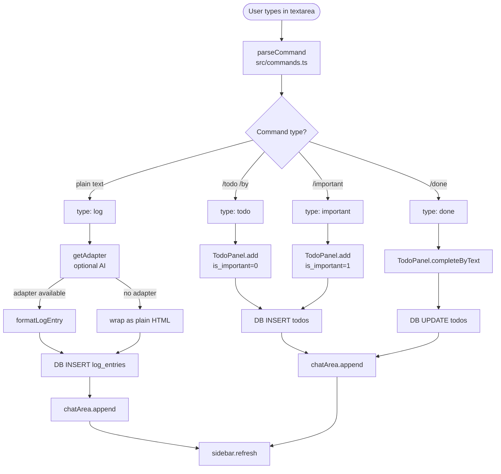

# DayLog

A minimal, distraction-free desktop journaling and task-tracking app. Log what you did, capture todos, and let AI format your entries — all from a single text input.

Built with **Tauri v2** + **Vanilla TypeScript** + **SQLite**.

---

## Features

- **Log entries** — type anything and it's formatted by AI into a clean structured entry
- **Todo management** — create, prioritize, and complete tasks with deadline support
- **Sidebar history** — browse past days with entry previews and completion counts
- **Log modal** — view all entries for the month in one overlay
- **AI formatting** — Anthropic or OpenAI-compatible backends (optional; falls back to raw text)
- **Export** — export all log entries to a Markdown file

---

## Architecture

```
┌─────────────────────────────────────────────────────────┐
│                     DayLog Desktop App                  │
│                                                         │
│  ┌──────────┐   ┌──────────────────┐   ┌─────────────┐ │
│  │ Sidebar  │   │    ChatArea      │   │  TodoPanel  │ │
│  │          │   │                  │   │             │ │
│  │ Day list │   │  Log feed        │   │ Important   │ │
│  │ previews │   │  (chat-style)    │   │ Due/Overdue │ │
│  │ stats    │   │                  │   │ Open        │ │
│  │          │   │  ┌────────────┐  │   │ Completed   │ │
│  │          │   │  │InputHandler│  │   │             │ │
│  │          │   │  │ (textarea) │  │   │             │ │
│  └──────────┘   │  └────────────┘  │   └─────────────┘ │
│                 └──────────────────┘                    │
│                                                         │
│  ┌─────────────────────────┐  ┌──────────────────────┐  │
│  │       LogModal          │  │    SettingsModal     │  │
│  │  (month log overlay)    │  │  (LLM config)        │  │
│  └─────────────────────────┘  └──────────────────────┘  │
└─────────────────────────────────────────────────────────┘
                         │ Tauri IPC (invoke)
┌─────────────────────────────────────────────────────────┐
│                    Rust Backend                         │
│    tauri-plugin-sql → SQLite  (migrations auto-run)    │
└─────────────────────────────────────────────────────────┘
```

### Input flow



### Frontend source layout

```
src/
├── app.ts                  ← App class + DOMContentLoaded bootstrap
├── components/
│   ├── ChatArea.ts         ← Central log feed
│   ├── InputHandler.ts     ← Textarea, submit, command highlighting
│   ├── LogModal.ts         ← Monthly log overlay
│   ├── SettingsModal.ts    ← LLM provider config
│   ├── Sidebar.ts          ← Past days list
│   └── TodoPanel.ts        ← Right-panel todo list
├── llm/
│   ├── adapter.ts          ← LLMAdapter interface
│   ├── anthropic.ts        ← Anthropic adapter
│   ├── factory.ts          ← getAdapter() — reads settings, returns adapter
│   └── openai.ts           ← OpenAI-compatible adapter
├── ai.ts                   ← formatLogEntry() — calls LLM to format raw text
├── commands.ts             ← parseCommand() — parses slash commands
├── db.ts                   ← query/execute/getSetting/setSetting wrappers
├── export.ts               ← exportMarkdown()
├── todoLogic.ts            ← todoStatus(), getTodoSections()
├── types.ts                ← TodoItem, Message, LogEntry, DayStats
├── utils.ts                ← escapeHtml(), stripHtml()
└── styles.css
```

---

## Commands

| Input | Action |
|-------|--------|
| `any plain text` | Creates a log entry (AI-formatted if configured) |
| `/todo <task>` | Creates an open todo |
| `/todo <task> /by <date>` | Creates a todo with a deadline |
| `/important <task>` | Creates a high-priority todo |
| `/done <partial task text>` | Marks the first matching open todo as complete |

---

## Database schema

SQLite database is managed by `tauri-plugin-sql`. Migrations run automatically at startup from `src-tauri/migrations/`.

### `log_entries`
| Column | Type | Notes |
|--------|------|-------|
| `id` | INTEGER PK | |
| `date` | TEXT | `YYYY-MM-DD` |
| `raw_text` | TEXT | original user input |
| `formatted_text` | TEXT | AI-formatted HTML |
| `created_at` | TEXT | ISO 8601 |

### `todos`
| Column | Type | Notes |
|--------|------|-------|
| `id` | INTEGER PK | |
| `text` | TEXT | |
| `is_important` | INTEGER | 0 or 1 |
| `is_completed` | INTEGER | 0 or 1 |
| `deadline` | TEXT | nullable, `YYYY-MM-DD` |
| `created_at` | TEXT | ISO 8601 |
| `completed_at` | TEXT | nullable, ISO 8601 |

### `settings`
| Column | Type | Notes |
|--------|------|-------|
| `key` | TEXT PK | `llm_provider`, `llm_api_key`, `llm_model`, `llm_base_url` |
| `value` | TEXT | |

---

## LLM configuration

Open **Settings** (gear icon) and configure:

| Field | Description |
|-------|-------------|
| Provider | `anthropic` or `openai` |
| API Key | Your API key |
| Model | e.g. `claude-haiku-4-5-20251001` or `gpt-4o-mini` |
| Base URL | OpenAI-compatible endpoint only (e.g. for local models) |

LLM is **optional** — if not configured, entries are saved as plain text wrapped in `<ul><li>`.

---

## Development setup

```bash
# Install dependencies
pnpm install

# Run the full Tauri desktop app (Vite dev server + Rust backend)
pnpm tauri dev

# Frontend only (Vite on http://localhost:1420)
pnpm dev

# Type-check + build frontend
pnpm build

# Run tests
pnpm test

# Build distributable app
pnpm tauri build
```

**Prerequisites:** [Rust](https://www.rust-lang.org/tools/install), [Node.js](https://nodejs.org/), [pnpm](https://pnpm.io/installation), [Tauri prerequisites](https://v2.tauri.app/start/prerequisites/)

### Building for macOS

```bash
# Install Xcode Command Line Tools (if not already)
xcode-select --install

pnpm install
pnpm tauri build
```

Output:

- `.dmg` installer → `src-tauri/target/release/bundle/dmg/`
- `.app` bundle → `src-tauri/target/release/bundle/macos/`

> The app is unsigned. To open locally, right-click → **Open** instead of double-clicking (Gatekeeper will block a double-click on unsigned apps).

### Building for Windows

Run on a Windows machine or VM — Tauri does not support macOS → Windows cross-compilation.

```powershell
# Install Rust
winget install Rustlang.Rustup

# Install Node.js (if needed)
winget install OpenJS.NodeJS

# Install pnpm
npm install -g pnpm

# Microsoft C++ Build Tools — required by Rust
# Download from https://visualstudio.microsoft.com/visual-cpp-build-tools/
# Select the "Desktop development with C++" workload

pnpm install
pnpm tauri build
```

Output:

- `.exe` NSIS installer → `src-tauri\target\release\bundle\nsis\`
- `.msi` installer → `src-tauri\target\release\bundle\msi\`

> First build takes 5–10 min while Rust compiles dependencies; subsequent builds are much faster.
> Installers are unsigned — Windows SmartScreen will warn users until a code-signing certificate is configured.

### CI builds (all platforms in parallel)

The [tauri-action](https://github.com/tauri-apps/tauri-action) GitHub Action builds for macOS, Windows, and Linux without needing local VMs. Add `.github/workflows/release.yml` using that action to automate releases.

---

## Design

`sample/daylog-mock.html` is the canonical UI reference — a self-contained HTML file with dark theme, three-column layout, and working interactions. Match it for visual design when building new features.

Fonts: **Instrument Serif** (headings) + **DM Mono** (body). Dark theme via CSS custom properties (`--bg`, `--surface`, `--text`, etc.).

---

## Tech stack

| Layer | Technology |
|-------|-----------|
| Desktop shell | Tauri v2 |
| Frontend | Vanilla TypeScript + Vite |
| Styling | CSS custom properties, no framework |
| Database | SQLite via `tauri-plugin-sql` |
| AI formatting | Anthropic API / OpenAI-compatible |
| Tests | Vitest + happy-dom |
| Package manager | pnpm |
