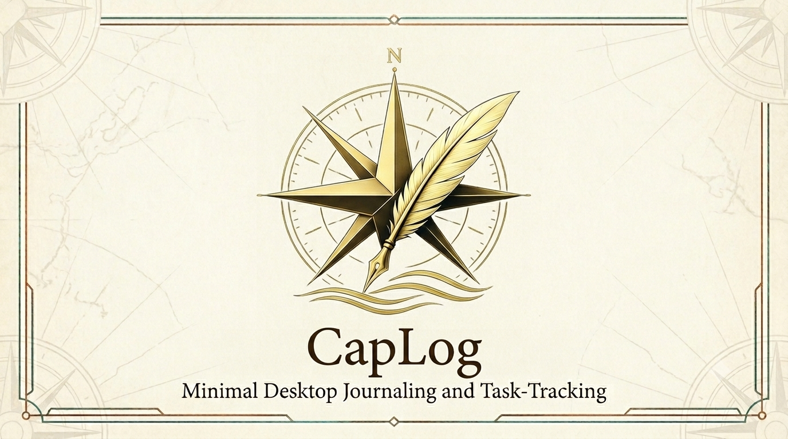
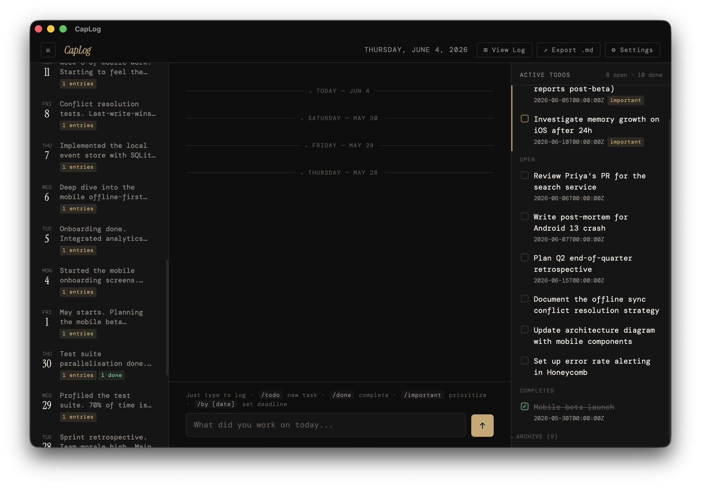
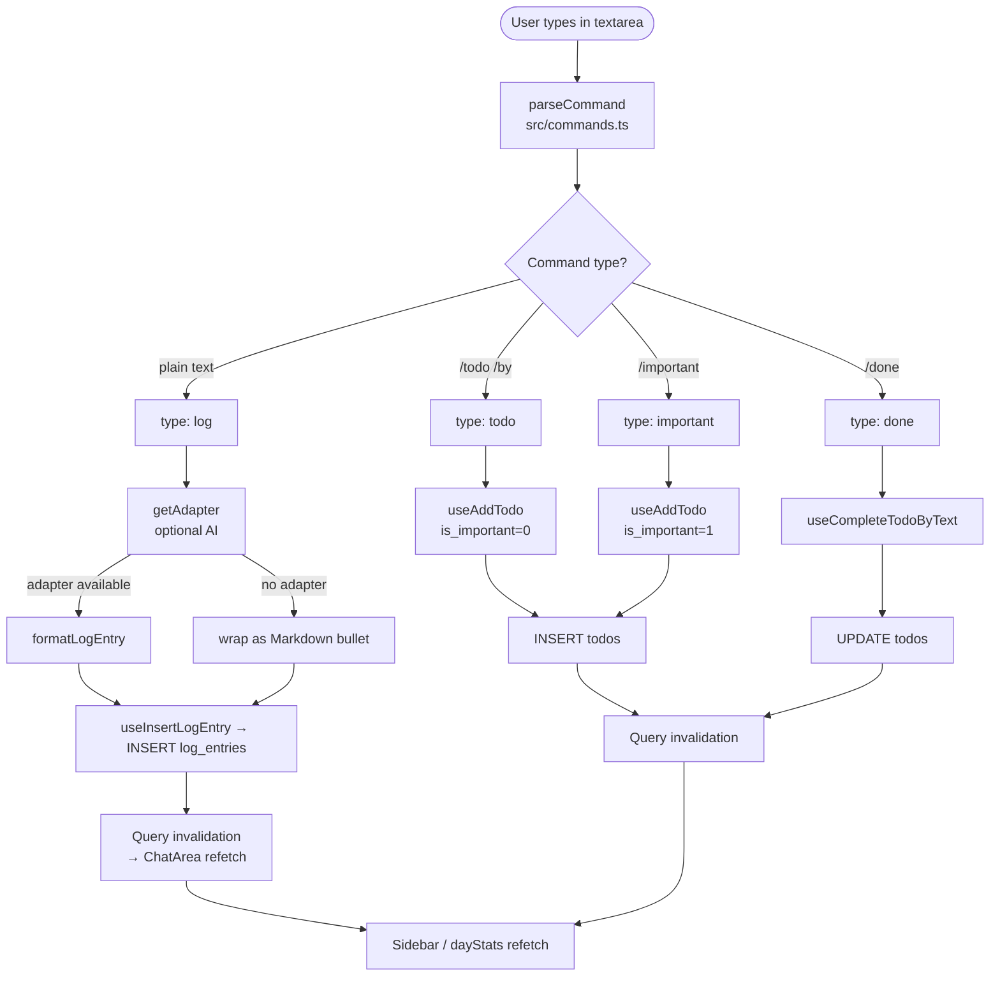

#  CapLog

<!-- description -->
A minimal, distraction-free desktop journaling and task-tracking app. Log what you did, capture todos, and let AI format your entries — all from a single text input.

Built with **Tauri v2** + **React + TypeScript** + **TanStack Query** + **SQLite**. Log entries are stored as **Markdown** and rendered with **react-markdown**.
<!-- /description -->


---

## Purpose
<!-- purpose -->
There are plenty of note-taking apps and todo apps — but they're always separate. I used to write my todos on sticky notes and end up losing the sticky note. Nothing worked as a single suite that doubles as a quick daily log. CapLog exists to fill that gap: one place that helps you quickly journal your day and track your tasks together.
<!-- /purpose -->

## Outcome
<!-- outcome -->
A simple, quick app that stays open on your desktop, where you can quickly journal your daily work progress — so when you want to know what you did last week, it's all right there. AI is integrated into the flow: as you type your journal, it converts your text into bullets, shortens it, and fixes spelling mistakes.
<!-- /outcome -->

## Tech Stack
<!-- techStack -->
| Layer | Technology |
|-------|------------|
| Desktop shell | Tauri v2 (Rust backend) |
| Frontend | React + TypeScript, built with Vite |
| State | TanStack Query |
| Storage | SQLite (via tauri-plugin-sql, auto-run migrations) |
| Content | Markdown, rendered with react-markdown (remark-gfm) |
| AI | Anthropic or OpenAI-compatible LLMs (optional) |
| Testing | Vitest + Testing Library + happy-dom |
| Package manager | pnpm |
<!-- /techStack -->
---

## Features

- **Log entries** — type anything and it's formatted by AI into a clean structured entry
- **Todo management** — create, prioritize, and complete tasks with deadline support; click the importance chip to instantly toggle priority, click the deadline chip to set or clear a due date inline
- **Sidebar history** — browse past days with entry previews and per-day completed todo counts
- **Chat feed** — today's entries at the top; past days shown below as collapsible sections
- **Log modal** — view all entries for the month in one overlay, with export
- **AI formatting** — Anthropic or OpenAI-compatible backends (optional; falls back to raw text)
- **Archive navigation** — calendar-style year view grouped by week; search across past entries by keyword, jump to any day with a click
- **Archive clean** — hover trash icons on day tiles, week cards, and month dividers; confirmation dialog shows exact entry and todo counts before permanently deleting the selected period
- **Export** — export all log entries to a Markdown file (header button or log modal footer)

---

## Architecture

```
┌─────────────────────────────────────────────────────────┐
│                     CapLog Desktop App                  │
│                                                         │
│  ┌──────────┐   ┌──────────────────┐   ┌─────────────┐ │
│  │ Sidebar  │   │    ChatArea      │   │  TodoPanel  │ │
│  │          │   │                  │   │             │ │
│  │ Day list │   │  Log feed        │   │ Important   │ │
│  │ previews │   │  (chat-style)    │   │ Due/Overdue │ │
│  │ stats    │   │                  │   │ Open        │ │
│  │          │   │  ┌────────────┐  │   │ Comp. today │ │
│  │          │   │  │ ChatInput  │  │   │             │ │
│  │          │   │  │ (textarea) │  │   │             │ │
│  └──────────┘   │  └────────────┘  │   └─────────────┘ │
│                 └──────────────────┘                    │
│                                                         │
│  ┌──────────────┐  ┌──────────────────┐  ┌────────────┐  │
│  │   LogModal   │  │  SettingsModal   │  │ArchiveModal│  │
│  │ (month log)  │  │  (LLM config)    │  │ (year view)│  │
│  └──────────────┘  └──────────────────┘  └────────────┘  │
└─────────────────────────────────────────────────────────┘
                         │ Tauri IPC (invoke)
┌─────────────────────────────────────────────────────────┐
│                    Rust Backend                         │
│    tauri-plugin-sql → SQLite  (migrations auto-run)    │
└─────────────────────────────────────────────────────────┘
```

### Input flow



### Frontend source layout

```
src/
├── main.tsx                ← initDB → migrations → render <Providers><App/>
├── app/
│   ├── App.tsx             ← Root layout, header, modal + notice state, submit logic
│   ├── providers.tsx       ← QueryClient + AppConfigProvider
│   └── AppConfigContext.tsx← chatDays, LLM adapter, current date (rollover)
├── components/
│   ├── ChatArea.tsx        ← Central log feed (Markdown), inline edit/delete
│   ├── ChatInput.tsx       ← Textarea, submit, command highlighting
│   ├── Markdown.tsx        ← Shared react-markdown renderer (raw HTML disabled)
│   ├── ArchiveModal.tsx    ← Year-view calendar archive + keyword search
│   ├── ArchiveConfirmModal.tsx ← Confirmation dialog for archive deletion
│   ├── LogModal.tsx        ← Monthly / single-day log overlay
│   ├── SettingsModal.tsx   ← LLM provider/model/chat_days config
│   ├── Sidebar.tsx         ← Past days list
│   ├── TodoPanel.tsx       ← Right-panel todo list
│   └── TodoItem.tsx        ← Single todo row with inline editing
├── data/                   ← Repositories: the only modules that import db.ts
│   ├── logEntriesRepo.ts
│   ├── todosRepo.ts
│   ├── settingsRepo.ts
│   └── archiveRepo.ts
├── hooks/                  ← TanStack Query hooks (useLogEntries, useTodos, …)
├── markdown/
│   ├── htmlToMarkdown.ts   ← Legacy HTML → Markdown converter
│   └── contentMigration.ts ← One-time startup HTML→Markdown migration
├── llm/
│   ├── adapter.ts          ← LLMAdapter interface
│   ├── anthropic.ts        ← Anthropic adapter
│   ├── factory.ts          ← getAdapter() — reads settings, returns adapter
│   └── openai.ts           ← OpenAI-compatible adapter
├── ai.ts                   ← formatLogEntry() — LLM formats raw text to Markdown
├── commands.ts             ← parseCommand() — parses slash commands
├── db.ts                   ← query/execute/getSetting/setSetting wrappers
├── export.ts               ← exportMarkdown()
├── feed.ts                 ← buildFeed() — pure chat-feed builder
├── todoLogic.ts            ← todoStatus(), getTodoSections()
├── types.ts                ← TodoItem, LogEntry, DayStats
├── utils.ts                ← escapeHtml(), date helpers
└── styles.css
```

---

## Commands

| Input | Action |
|-------|--------|
| `any plain text` | Creates a log entry (AI-formatted if configured) |
| `/todo <task>` | Creates an open todo |
| `/todo <task> /by <date>` | Creates a todo with a deadline |
| `/important <task>` | Creates a high-priority todo |
| `/done <partial task text>` | Marks the first matching open todo as complete |

---

## Database schema

SQLite database is managed by `tauri-plugin-sql`. Migrations run automatically at startup from `src-tauri/migrations/`.

### Where the database is stored

The connection string is the relative path `sqlite:caplog.db` (see `src/db.ts` and `src-tauri/src/lib.rs`). `tauri-plugin-sql` resolves relative paths into the app config directory, which is derived from the bundle `identifier` (`com.bipin.caplog` in `src-tauri/tauri.conf.json`). Dev and production builds share the same identifier, so they use the same file.

| Platform | Location |
|----------|----------|
| Windows | `%APPDATA%\com.bipin.caplog\caplog.db` (e.g. `C:\Users\<you>\AppData\Roaming\com.bipin.caplog\caplog.db`) |
| macOS | `~/Library/Application Support/com.bipin.caplog/caplog.db` |
| Linux | `~/.config/com.bipin.caplog/caplog.db` |

### `log_entries`
| Column | Type | Notes |
|--------|------|-------|
| `id` | INTEGER PK | |
| `date` | TEXT | `YYYY-MM-DD` |
| `raw_text` | TEXT | original user input |
| `formatted_text` | TEXT | AI-formatted HTML |
| `created_at` | TEXT | ISO 8601 |

### `todos`
| Column | Type | Notes |
|--------|------|-------|
| `id` | INTEGER PK | |
| `text` | TEXT | |
| `is_important` | INTEGER | 0 or 1 |
| `is_completed` | INTEGER | 0 or 1 |
| `deadline` | TEXT | nullable, `YYYY-MM-DD` |
| `created_at` | TEXT | ISO 8601 |
| `completed_at` | TEXT | nullable, ISO 8601 |

### `settings`
| Column | Type | Notes |
|--------|------|-------|
| `key` | TEXT PK | `llm_provider`, `llm_api_key`, `llm_model`, `llm_base_url`, `chat_days` |
| `value` | TEXT | |

**Known keys:**

| Key | Default | Description |
|-----|---------|-------------|
| `llm_provider` | — | `anthropic` or `openai` |
| `llm_api_key` | — | API key for the selected provider |
| `llm_model` | — | Model name (e.g. `claude-haiku-4-5-20251001`) |
| `llm_base_url` | — | Base URL for OpenAI-compatible endpoints |
| `chat_days` | `3` | How many days of history to show in the sidebar and completed-todo cutoff |

---

## LLM configuration

Open **Settings** (gear icon) and configure:

| Field | Description |
|-------|-------------|
| Provider | `anthropic` or `openai` |
| API Key | Your API key |
| Model | e.g. `claude-haiku-4-5-20251001` or `gpt-4o-mini` |
| Base URL | OpenAI-compatible endpoint only (e.g. for local models) |
| Show days | Number of past days to show in the sidebar and completed-todo list (default: 3) |

LLM is **optional** — if not configured, entries are saved as plain text wrapped in `<ul><li>`.

---

## Development setup

```bash
# Install dependencies
pnpm install

# Run the full Tauri desktop app (Vite dev server + Rust backend)
pnpm tauri dev

# Frontend only (Vite on http://localhost:1420)
pnpm dev

# Type-check + build frontend
pnpm build

# Run tests
pnpm test

# Build distributable app
pnpm tauri build
```

**Prerequisites:** [Rust](https://www.rust-lang.org/tools/install), [Node.js](https://nodejs.org/), [pnpm](https://pnpm.io/installation), [Tauri prerequisites](https://v2.tauri.app/start/prerequisites/)

### Building for macOS

```bash
# Install Xcode Command Line Tools (if not already)
xcode-select --install

pnpm install
pnpm tauri build
```

Output:

- `.dmg` installer → `src-tauri/target/release/bundle/dmg/`
- `.app` bundle → `src-tauri/target/release/bundle/macos/`

> The app is unsigned. To open locally, right-click → **Open** instead of double-clicking (Gatekeeper will block a double-click on unsigned apps).

### Building for Windows

Run on a Windows machine or VM — Tauri does not support macOS → Windows cross-compilation.

```powershell
# Install Rust
winget install Rustlang.Rustup

# Install Node.js (if needed)
winget install OpenJS.NodeJS

# Install pnpm
npm install -g pnpm

# Microsoft C++ Build Tools — required by Rust
# Download from https://visualstudio.microsoft.com/visual-cpp-build-tools/
# Select the "Desktop development with C++" workload

pnpm install
pnpm tauri build
```

Or use the helper script that checks prerequisites and loads the MSVC environment automatically:

```powershell
# From the repo root
./scripts/build-windows.ps1
```

Output:

- `.exe` NSIS installer → `src-tauri\target\release\bundle\nsis\`
- `.msi` installer → `src-tauri\target\release\bundle\msi\`

> First build takes 5–10 min while Rust compiles dependencies; subsequent builds are much faster.
> Installers are unsigned — Windows SmartScreen will warn users until a code-signing certificate is configured.

#### Windows build FAQ / troubleshooting

**Q: `Found version mismatched Tauri packages` — e.g. `tauri (v2.11.2) : @tauri-apps/api (v2.10.1)`**

The Rust `tauri` crate and the npm `@tauri-apps/api` / `@tauri-apps/cli` packages must share the same `major.minor` version. Update the npm side to match:

```powershell
pnpm update @tauri-apps/api @tauri-apps/cli
```

If pnpm refuses to bump across a minor, pin the exact version in `package.json` (e.g. `"@tauri-apps/api": "^2.11.0"`) and re-run `pnpm install`.

**Q: `LINK : fatal error LNK1104: cannot open file 'msvcrt.lib'` (or `libcmt.lib`, `kernel32.lib`, `ucrt.lib`)**

The Rust MSVC linker can't find the Windows SDK / CRT libraries because the MSVC environment variables (`LIB`, `INCLUDE`, `PATH`) aren't set in your shell. Two common causes:

1. **You're running in a plain PowerShell window.** Fix: launch **"x64 Native Tools Command Prompt for VS 2022"** from the Start menu, or load the env into your current shell:

   ```powershell
   cmd /c '"C:\Program Files\Microsoft Visual Studio\2022\Enterprise\VC\Auxiliary\Build\vcvars64.bat" && set' |
     Where-Object { $_ -match '^(LIB|INCLUDE|LIBPATH|Path)=' } |
     ForEach-Object { $n,$v = $_ -split '=',2; [Environment]::SetEnvironmentVariable($n,$v,'Process') }
   ```

   (Adjust the path for `Community` / `Professional` editions.)

2. **You have multiple VS installs and the one picked up is incomplete** — e.g. only the `OneCore` subset of MSVC libs was installed, so `msvcrt.lib` lives under `VC\Tools\MSVC\<ver>\lib\onecore\x64\` but not under `lib\x64\`. Fix: open the Visual Studio Installer, **Modify** the install, and add the **"Desktop development with C++"** workload (which installs the full Desktop x64 CRT). Or uninstall the partial toolchain so the linker uses a complete one. The helper script `scripts/build-windows.ps1` automatically skips installs that don't contain the Desktop x64 CRT.

**Q: `error: linker 'link.exe' not found`**

You have no MSVC toolchain at all. Install the **"Desktop development with C++"** workload via the [Visual Studio Build Tools installer](https://visualstudio.microsoft.com/visual-cpp-build-tools/), then restart your terminal so `link.exe` is on `PATH`.

**Q: WebView2 / WiX / NSIS download errors during bundling**

`tauri build` downloads WiX (for `.msi`) and NSIS (for `.exe`) on first use. If you're behind a proxy, set `HTTPS_PROXY` before building. If a download is corrupt, delete `%LOCALAPPDATA%\tauri` and rebuild.

**Q: First build is extremely slow**

Normal — Rust compiles the full dependency tree (300+ crates) on first build. Subsequent builds reuse `target\` and complete in seconds. Don't delete `src-tauri\target\` unless you actually need a clean rebuild.

### CI builds (all platforms in parallel)

The [tauri-action](https://github.com/tauri-apps/tauri-action) GitHub Action builds for macOS, Windows, and Linux without needing local VMs. Add `.github/workflows/release.yml` using that action to automate releases.

---

## Design

`sample/caplog-mock.html` is the canonical UI reference — a self-contained HTML file with dark theme, three-column layout, and working interactions. Match it for visual design when building new features.

Fonts: **Instrument Serif** (headings) + **DM Mono** (body). Dark theme via CSS custom properties (`--bg`, `--surface`, `--text`, etc.).

---

## Tech stack

| Layer | Technology |
|-------|-----------|
| Desktop shell | Tauri v2 |
| Frontend | React + TypeScript + Vite |
| Data/state | TanStack Query (React Query) |
| Content rendering | Markdown via react-markdown + remark-gfm |
| Styling | CSS custom properties, no framework |
| Database | SQLite via `tauri-plugin-sql` |
| AI formatting | Anthropic API / OpenAI-compatible |
| Tests | Vitest + happy-dom + Testing Library |
| Package manager | pnpm |
