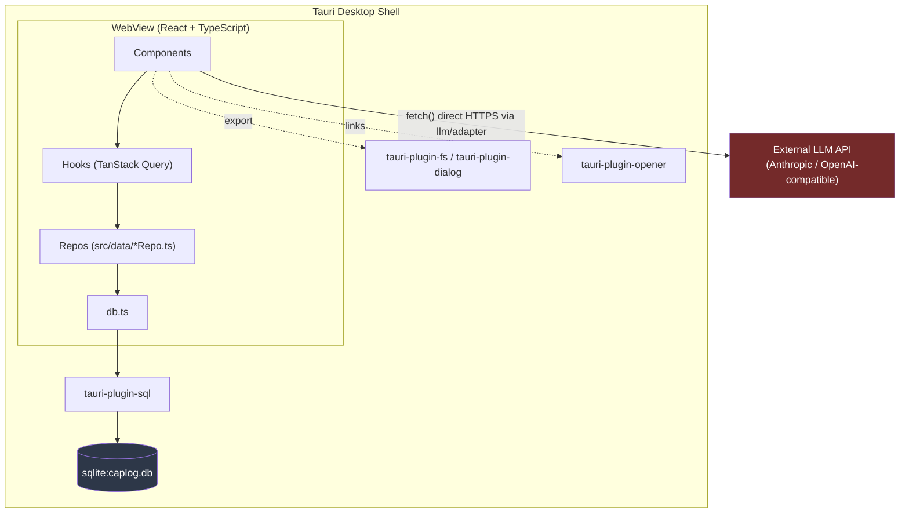
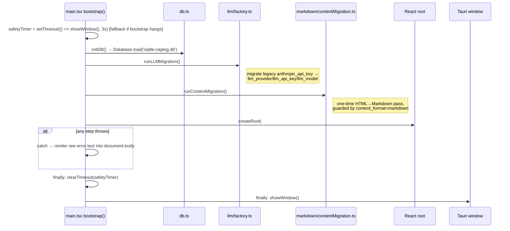
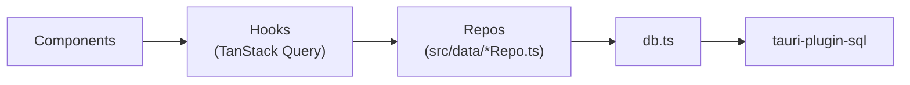
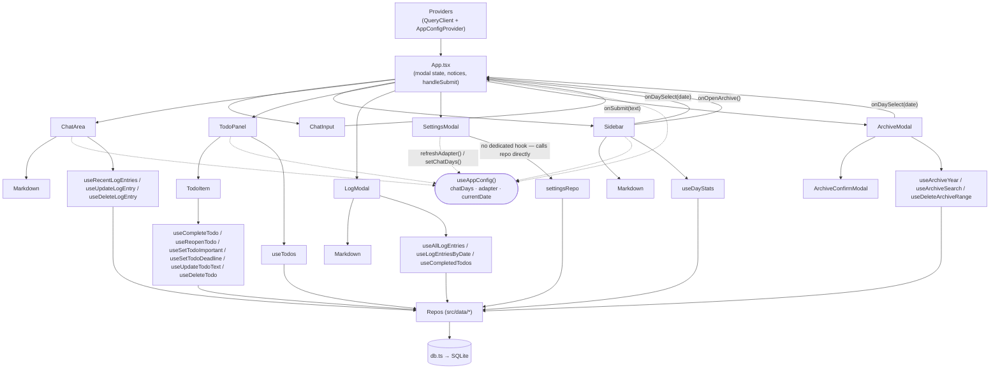
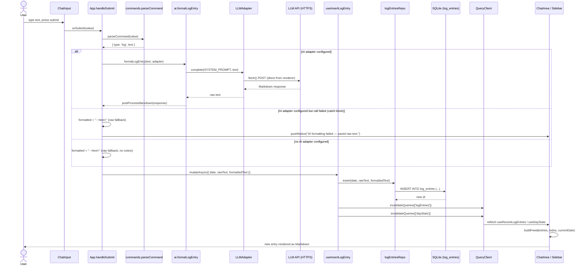
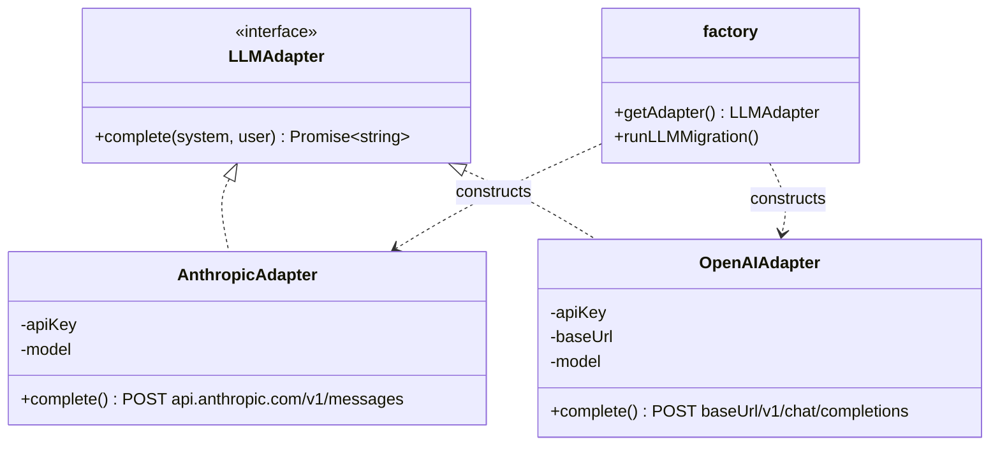
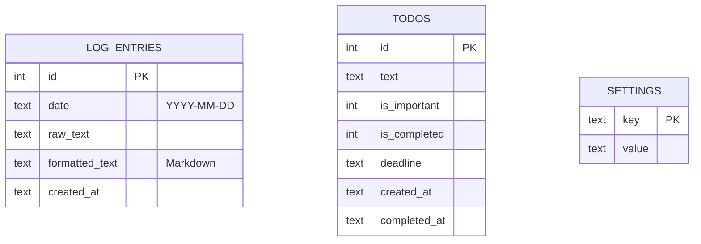

# CapLog Architecture

CapLog is a **Tauri v2** desktop application: a React/TypeScript frontend rendered in a native
webview, backed by a **local SQLite database** accessed directly from the frontend through the
`tauri-plugin-sql` plugin. There is no application server and no custom Rust IPC layer — the Rust
side exists mainly to host the webview and wire up plugins (SQL, filesystem, dialog, opener). All
business logic (parsing commands, building the feed, talking to LLM providers, exporting Markdown)
lives in TypeScript.



There is no backend server in the middle of the LLM calls — `fetch()` is issued directly from the
renderer to `api.anthropic.com` or a user-configured OpenAI-compatible `baseUrl`, using an API key
stored in the local SQLite `settings` table.

---

## 1. Process model

| Process | Technology | Responsibility |
|---|---|---|
| **Main process** | Rust (`src-tauri/src/main.rs` → `lib.rs`) | Creates the OS window, registers plugins, runs SQL migrations at startup, hosts the webview. Has an **empty** `invoke_handler![]` — no custom Rust commands are exposed. |
| **Renderer process** | React 19 + TypeScript, running inside the Tauri webview | Entire application: UI, state, business logic, DB queries (via plugin), LLM calls (via `fetch`). |

Because there are no custom `#[tauri::command]` functions, the frontend never uses
`invoke()` for app logic — the "backend" is really just the SQLite database and the OS-level
plugin bridge (`tauri-plugin-sql`, `tauri-plugin-fs`, `tauri-plugin-dialog`, `tauri-plugin-opener`).

### Rust side (`src-tauri/src/lib.rs`)

The snippet below is a simplified paraphrase of `pub fn run()` for illustration (it omits the
`#[cfg_attr(mobile, tauri::mobile_entry_point)]` attribute, the `.expect(...)` on `.run()`, and
collapses the real inline `tauri_plugin_sql::Migration { .. }` struct literals into a shorthand
`vec![migration_001, migration_002]`) — see the actual file for verbatim source.

```rust
tauri::Builder::default()
    .plugin(tauri_plugin_opener::init())
    .plugin(tauri_plugin_fs::init())
    .plugin(tauri_plugin_dialog::init())
    .plugin(
        tauri_plugin_sql::Builder::default()
            .add_migrations("sqlite:caplog.db", vec![migration_001, migration_002])
            .build(),
    )
    .invoke_handler(tauri::generate_handler![])   // no custom commands
    .run(tauri::generate_context!())
```

- **Migrations run automatically** on startup, before the webview can query the DB. They live in
  `src-tauri/migrations/*.sql` and are embedded into the binary via `include_str!`.
  - `001_init.sql` — creates `log_entries`, `todos`, `settings`.
  - `002_settings_chat_days.sql` — seeds `settings.chat_days = '3'`.
- **Plugins**:
  - `tauri-plugin-sql` — exposes a JS `Database` handle (`@tauri-apps/plugin-sql`) for `select`/`execute` against `caplog.db`.
  - `tauri-plugin-fs` — used by the frontend to write the exported Markdown file.
  - `tauri-plugin-dialog` — native "Save As" file picker for export.
  - `tauri-plugin-opener` — opens links from rendered Markdown in the system browser.

---

## 2. Startup sequence (`src/main.tsx`)



The 3-second `setTimeout` is a **fallback safety net**, not a step that always fires: in the normal
(fast) path it is `clearTimeout`'d in the `finally` block before `showWindow()` is called, so the
timer callback never runs. It only fires — showing the window early — if `initDB()` /
`runLLMMigration()` / `runContentMigration()` / the React render hangs for 3+ seconds. If any step
throws, the error is caught and rendered as plain text into `document.body` (a raw fallback,
bypassing React) so a broken DB/migration never leaves the user with a blank window; either way,
`finally` still clears the timer and shows the window. `showWindow()` itself wraps
`getCurrentWindow().show()` in its own try/catch that only `console.error`s on failure — so even
this fallback "show the window" step can silently fail without surfacing anything to the user.

---

## 3. Layered architecture (frontend)

The codebase enforces a strict one-directional dependency rule:



**Only `src/data/*Repo.ts` files are allowed to import `db.ts`.** Components never call
`invoke`, `Database`, or `tauri-plugin-sql` directly — they go through a repo-backed query hook.
This is enforced by convention (see `CLAUDE.md`), not by a lint rule, and there are two known
exceptions: `src/export.ts` (reads via `query()` directly — see §8) and `src/llm/factory.ts`
(reads/writes `settings` via `getSetting`/`setSetting`/`deleteSetting` from `db.ts` directly,
bypassing `settingsRepo` — see §6). Separately, `SettingsModal` is the one *component* that calls
a repo (`settingsRepo`) directly rather than through a TanStack Query hook — there is no dedicated
`useSettings` hook wrapping settings mutations (see §3.4).

### 3.1 `db.ts` — thin SQLite wrapper

```ts
initDB()                 // Database.load('sqlite:caplog.db'), called once at bootstrap
query<T>(sql, params)    // db.select(...)
execute(sql, params)     // db.execute(...)
getSetting/setSetting/deleteSetting(key)  // convenience wrappers over the `settings` table
```

### 3.2 Repos (`src/data/*Repo.ts`) — the only SQL in the app

| Repo | Table(s) | Key operations |
|---|---|---|
| `logEntriesRepo` | `log_entries` | `listRecent(days)`, `listAll()`, `getByDate(date)`, `insert`, `update`, `remove`, `listDayStats(days)` (a UNION query combining log-day counts and todo-only-completion days for the sidebar) |
| `todosRepo` | `todos` | `list(cutoffDays?)` (open todos always included; completed todos older than the cutoff excluded), `listCompleted()`, `getById(id)`, `add`, `completeTodo`, `completeByText` (fuzzy `LIKE` match, used by `/done`), `reopen`, `setImportant`, `setDeadline`, `updateText`, `remove` |
| `settingsRepo` | `settings` | Generic `get/set/remove`, plus typed helpers: `getChatDays`/`setChatDays` (clamped 1–14), `getLLMConfig`/`saveLLMConfig`/`clearLLMConfig` |
| `archiveRepo` | `log_entries`, `todos` | Year-level aggregates for the Archive calendar: `yearEntryCounts`, `yearDoneCounts`, `searchDates` (keyword search across `formatted_text`), `countRange`/`deleteRange` (day/week/month bulk delete for "clean up" workflows) |

Repos return **typed domain objects** (`LogEntry`, `TodoItem`, `DayStats`) defined in
`src/types.ts` — never raw `unknown` rows — so a future move to a different storage backend
would only require reimplementing this layer.

### 3.3 Hooks (`src/hooks/*.ts`) — TanStack Query bindings

`src/hooks/queryKeys.ts` is the single source of truth for query key shapes (`logEntries`,
`todos`, `dayStats`, `settings`, plus `archive`).

- `useLogEntries.ts` — `useRecentLogEntries(days)`, `useAllLogEntries()`, `useLogEntriesByDate(date)`,
  plus mutations `useInsertLogEntry`/`useUpdateLogEntry`/`useDeleteLogEntry`.
- `useTodos.ts` — `useTodos(cutoffDays?)`, `useCompletedTodos()`, plus mutations for add/complete/
  complete-by-text/reopen/set-important/set-deadline/update-text/delete.
- `useDayStats.ts` — `useDayStats(days)` for the sidebar's per-day summary cards.
- `useArchive.ts` — `useArchiveYear(year)` (builds week buckets via `archiveUtils.buildWeeks`),
  `useArchiveSearch(year, q)`, `useDeleteArchiveRange()`.

**Invalidation strategy**: the `QueryClient` is configured with `staleTime: Infinity` and
`retry: false` (`src/app/providers.tsx`) — this is an **invalidate-driven** cache, appropriate for
a fast local SQLite store with no network latency. Every mutation hook explicitly invalidates the
query keys it can affect:
- A log-entry mutation invalidates `logEntries` + `dayStats`.
- A todo mutation invalidates `todos` **and** `logEntries` + `dayStats`, because created/completed
  todos also render inline in the chat feed and affect the sidebar's daily counts.
- Deleting an archive range invalidates `archive`, `logEntries`, `todos`, `dayStats` (it can delete
  rows from both tables across an arbitrary date range).

### 3.4 Components (`src/components/`, `src/app/`)

`src/app/App.tsx` is the root orchestrator: it owns modal open-state (`log | settings | archive |
none`), ephemeral `Notice[]` state (system messages like "AI formatting failed — saved raw text"),
and `handleSubmit`, which is the single entry point for turning chat input into a mutation.

| Component | Role |
|---|---|
| `ChatInput` | Textarea; on submit, hands raw text to `App.handleSubmit` |
| `ChatArea` | Renders the feed via `buildFeed()`; today's section open, past days collapsible `<details>`; renders log entries as Markdown with inline edit/delete; renders today-only system `Notice`s |
| `Sidebar` | Left column; `useDayStats(chatDays)` cards, click → opens `LogModal` for that day; "Archive" button → opens `ArchiveModal` |
| `TodoPanel` / `TodoItem` | Right column; sections via `todoLogic.getTodoSections()` (Important → Due/Overdue → Open → Completed); inline text/meta editing per item |
| `LogModal` | Overlay: `day === null` → month view (`buildDayLogs`); a specific date → single-day view; footer "Export .md" |
| `SettingsModal` | LLM provider/key/model/baseUrl + `chat_days`; save → `settingsRepo.saveLLMConfig` + `refreshAdapter()` + `setChatDays()` |
| `ArchiveModal` / `ArchiveConfirmModal` | Year calendar (`useArchiveYear` + `buildWeeks`); keyword search (`useArchiveSearch`); "clean range" flow behind a confirm dialog (`useDeleteArchiveRange`) |
| `Markdown` | Shared `react-markdown` renderer (`remark-gfm`, raw HTML disabled); `inline`/block modes; links open via `tauri-plugin-opener` instead of in-webview navigation |

**Component connection graph:**



`src/app/AppConfigContext.tsx` (`AppConfigProvider` / `useAppConfig()`) is the app-wide config
store, independent of TanStack Query's server-state cache:

- `chatDays` — sidebar/feed window size (persisted in `settings`), with `setChatDays()` also
  invalidating `logEntries`/`todos`/`dayStats`.
- `adapter` — the current `LLMAdapter | null`, built once at startup via `getAdapter()` and
  rebuilt on demand via `refreshAdapter()` (called after Settings save).
- `currentDate` — local `YYYY-MM-DD`, refreshed by a **60-second interval** that detects a local
  day rollover and invalidates `logEntries`/`todos`/`dayStats` so the feed re-buckets into "Today".

**Recurring/deferred timers in the app** (`grep -rn "setInterval|setTimeout" src/`, three total):
1. `src/main.tsx` — one-shot 3s `setTimeout` safety net during bootstrap (see §2).
2. `src/app/AppConfigContext.tsx` — 60s `setInterval` polling for a local day rollover (above).
3. `src/components/ArchiveModal.tsx` — 200ms `setTimeout` debouncing the Archive search input
   before it drives `useArchiveSearch` (cleared/reset on every keystroke via `clearTimeout` in the
   effect's cleanup).

---

## 4. Data flow: submitting a log entry

This is the core interaction loop, driven by `App.handleSubmit` (`src/app/App.tsx`):



Slash commands follow the same `parseCommand` → mutation → invalidate → refetch shape:
- `/todo <text> [/by <deadline>]` → `useAddTodo`
- `/important <text>` → `useAddTodo({ isImportant: true })`
- `/done <task>` → `useCompleteTodoByText` (fuzzy case-insensitive `LIKE` match against open
  todos); pushes a Notice reporting whether a match was found

---

## 5. Feed assembly (`src/feed.ts`)

`buildFeed(entries, todos, today)` is a pure function (no I/O) that merges two independently
fetched, independently invalidated data sets — recent `LogEntry[]` and the windowed `TodoItem[]`
— into day-grouped `FeedDay[]` for `ChatArea`:

1. Collect the set of dates that need a section: every date with a log entry, every date a todo
   was **completed** on, plus `today` (always shown even if empty).
2. Within each date: log entries render as `log` items; todos **created** that day render as
   `todo-created` **unless** they were also completed that same day, in which case they render as
   `todo-completed` (a same-day create+complete never shows two rows); todos completed on a
   *different* day than they were created render as `todo-completed` on the completion date.
3. Items within a day are sorted by their effective timestamp (`created_at` for logs/creation,
   `completed_at` for a separate completion event).

`LogModal`'s month view and `exportMarkdown()` use a sibling aggregator,
`buildDayLogs()` (`src/logAggregation.ts`), which buckets **all** entries (not just the
`chatDays` window) plus completed todos into `DayLog[]` — this is the "full history" view, distinct
from the chat feed's recent window.

---

## 6. LLM integration (`src/llm/`)



- **No backend proxy.** Both adapters call `fetch()` directly from the renderer process using an
  API key read out of the local SQLite `settings` table. The key never leaves the machine except
  in the direct HTTPS request to the configured provider.
- `factory.ts::getAdapter()` reads `llm_provider` / `llm_api_key` / `llm_model` /
  (`llm_base_url` for OpenAI-compatible) directly from `db.ts` (one of the two exceptions to the
  "only repos import `db.ts`" rule — see §3) each time it's called and constructs the matching
  adapter, or returns `null` if unconfigured — this is what drives the "AI Active" / "No AI" pill
  in the header (`AppConfigContext.adapter`). For `provider === 'openai'`, a missing
  `llm_base_url` is also treated as unconfigured: `getAdapter()` logs a `console.warn` and returns
  `null` rather than throwing.
- `factory.ts::runLLMMigration()` is a one-time startup migration: an old single-key
  `anthropic_api_key` setting is rewritten into the new `llm_provider`/`llm_api_key`/`llm_model`
  shape (defaulting the model to `claude-haiku-4-5-20251001`), then the old key is deleted.
- `src/ai.ts` owns the **prompt contract**: `SYSTEM_PROMPT` instructs the model to reformat raw
  text into concise Markdown bullets while staying strictly grounded in the input (no invented
  facts), and `postProcessMarkdown()` strips stray code fences / collapses excess blank lines from
  the model's response before it's stored.
- **Failure handling**: any adapter error (network failure, non-2xx, empty response) is caught by
  the caller (`App.tsx` for new entries, `ChatArea.LogMessage` for inline edits) and falls back to
  storing the raw text as a plain Markdown bullet — the app is fully usable with AI formatting
  disabled or failing.

### External services

| Service | Endpoint | Auth | Data sent |
|---|---|---|---|
| Anthropic API | `https://api.anthropic.com/v1/messages` | `x-api-key` header (from `settings.llm_api_key`) | The raw log-entry text being formatted, plus the fixed system prompt. Nothing else in the DB is sent. |
| OpenAI-compatible API | `{settings.llm_base_url}/v1/chat/completions` | `Authorization: Bearer <key>` | Same — user-configurable, so this can point at any self-hosted or third-party OpenAI-compatible endpoint. |

No other network calls exist in the app — everything else (log storage, todos, settings, archive,
export) is local SQLite + local filesystem.

---

## 7. Markdown pipeline

CapLog stores log content as Markdown, not HTML:

- A **no-AI** entry is stored verbatim as `- <text>` (a single Markdown bullet).
- An **AI-formatted** entry stores the LLM's post-processed Markdown response directly.
- Rendering always goes through `src/components/Markdown.tsx` — `react-markdown` + `remark-gfm`,
  with raw HTML rendering **intentionally disabled** (defense against any HTML that might have
  leaked in from the legacy format or a misbehaving LLM response). Links render via
  `tauri-plugin-opener` so clicking a Markdown link opens the system browser instead of navigating
  the app's webview.
- `src/markdown/htmlToMarkdown.ts` is a **legacy converter**: earlier versions of CapLog stored
  `formatted_text` as HTML. `src/markdown/contentMigration.ts::runContentMigration()` is a
  one-time, idempotent startup migration (guarded by `settings.content_format = 'markdown'`) that
  walks every existing `log_entries` row through `htmlToMarkdown()` and rewrites it. Failures are
  logged and simply retried on the next launch (non-blocking — the app doesn't fail to start if
  migration fails).

---

## 8. Archive & export

- **Archive** (`ArchiveModal` + `archiveRepo` + `archiveUtils.buildWeeks`) gives a year-calendar
  view: per-day entry/completion counts aggregated into Monday-start week rows
  (`getWeekStart`/`buildWeeks`), plus keyword search over `formatted_text`
  (`archiveRepo.searchDates`). A "clean range" flow (day/week/month) previews counts via
  `countRange` then deletes via `deleteRange`, gated behind `ArchiveConfirmModal` since it's a
  destructive, irreversible operation on both `log_entries` and `todos`.
- **Export** (`src/export.ts::exportMarkdown()`) reads every log entry and every completed todo
  directly (bypassing repos, using `query()` from `db.ts`), buckets them via the shared
  `buildDayLogs()` aggregator, and renders a single Markdown document (`# CapLog Export`, one `##`
  section per day, completed todos as `- [x]` items). The file is written via
  `tauri-plugin-dialog`'s native save picker + `tauri-plugin-fs`'s `writeTextFile` — no data leaves
  the machine.
- `src/export.ts` and `src/llm/factory.ts` are the two documented exceptions to the "only repos
  import `db.ts`" rule (see §3) — `factory.ts` calls `getSetting`/`setSetting`/`deleteSetting`
  from `db.ts` directly instead of going through `settingsRepo`.

---

## 9. Database schema



```sql
-- 001_init.sql
CREATE TABLE log_entries (
  id             INTEGER PRIMARY KEY AUTOINCREMENT,
  date           TEXT NOT NULL,   -- local YYYY-MM-DD, the day this entry belongs to
  raw_text       TEXT NOT NULL,   -- exactly what the user typed
  formatted_text TEXT NOT NULL,   -- Markdown: AI-formatted, or `- <raw_text>` if no AI
  created_at     TEXT NOT NULL    -- local ISO-ish timestamp, YYYY-MM-DDTHH:MM:SS.mmm
);

CREATE TABLE todos (
  id           INTEGER PRIMARY KEY AUTOINCREMENT,
  text         TEXT NOT NULL,
  is_important INTEGER NOT NULL DEFAULT 0,
  is_completed INTEGER NOT NULL DEFAULT 0,
  deadline     TEXT,             -- free-form date string from `/todo ... /by <deadline>`
  created_at   TEXT NOT NULL,
  completed_at TEXT              -- set on completion; NULL while open
);

CREATE TABLE settings (
  key   TEXT PRIMARY KEY,
  value TEXT NOT NULL
);
-- 002_settings_chat_days.sql
INSERT OR IGNORE INTO settings (key, value) VALUES ('chat_days', '3');
```

Known `settings` keys (all managed through `settingsRepo`): `chat_days`, `llm_provider`,
`llm_api_key`, `llm_model`, `llm_base_url`, `content_format` (migration flag), plus the legacy
`anthropic_api_key` (deleted by `runLLMMigration()` after one startup).

`date` on `log_entries` and `DATE(completed_at)` on `todos` are the two "day key" surfaces the
whole app pivots on — feed grouping, sidebar stats, archive aggregation, and export all bucket by
one or both of these.

---

## 10. Testing architecture

Tests (`src/__tests__/`, run via Vitest + happy-dom) mirror the layering:

- **Pure-logic unit tests** for `commands`, `todoLogic`, `utils`, `ai`, `db`, `export`, `feed`,
  `logAggregation`, `markdown/*`, `llm/*` — no rendering involved.
- **Repo/hook tests** mock `db.ts` (or the repo module directly) to verify SQL shape and
  invalidation behavior without a real SQLite connection.
- **Component tests** (`__tests__/components/`) use React Testing Library +
  `renderWithProviders` (wraps a fresh `QueryClient` + `AppConfigProvider`), mocking at the repo
  boundary (`vi.mock('../../data/...Repo')`) and the LLM factory — so component tests never touch
  real SQL or real network calls.
- Tauri plugins (`@tauri-apps/plugin-sql`, `-fs`, `-dialog`, `-opener`) are mocked globally in
  `src/__mocks__/tauri-plugins.ts`.

This means the three architectural boundaries — **UI/hooks**, **repo/SQL**, and **Tauri
plugin/OS** — can each be tested in isolation, matching the `components → hooks → repos → db`
dependency chain enforced across the codebase.
